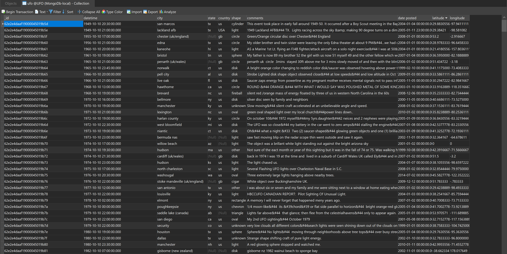
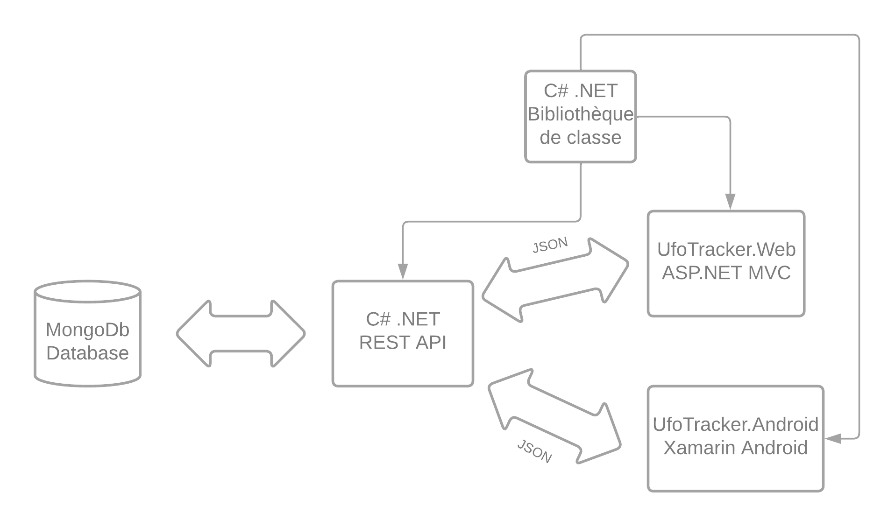
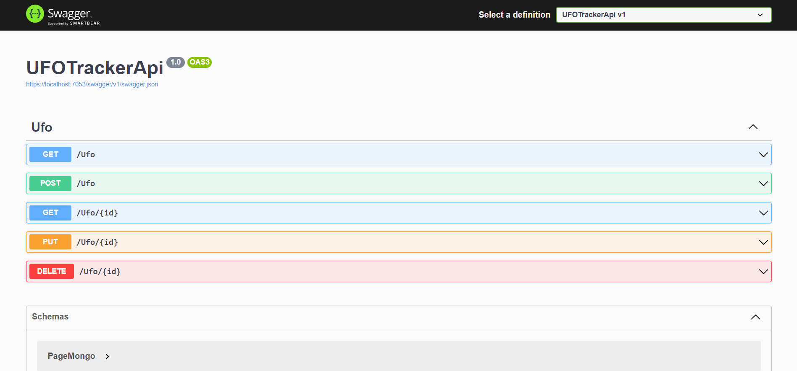
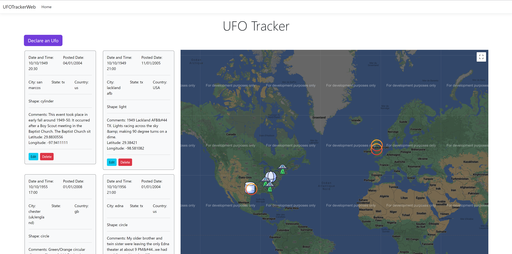
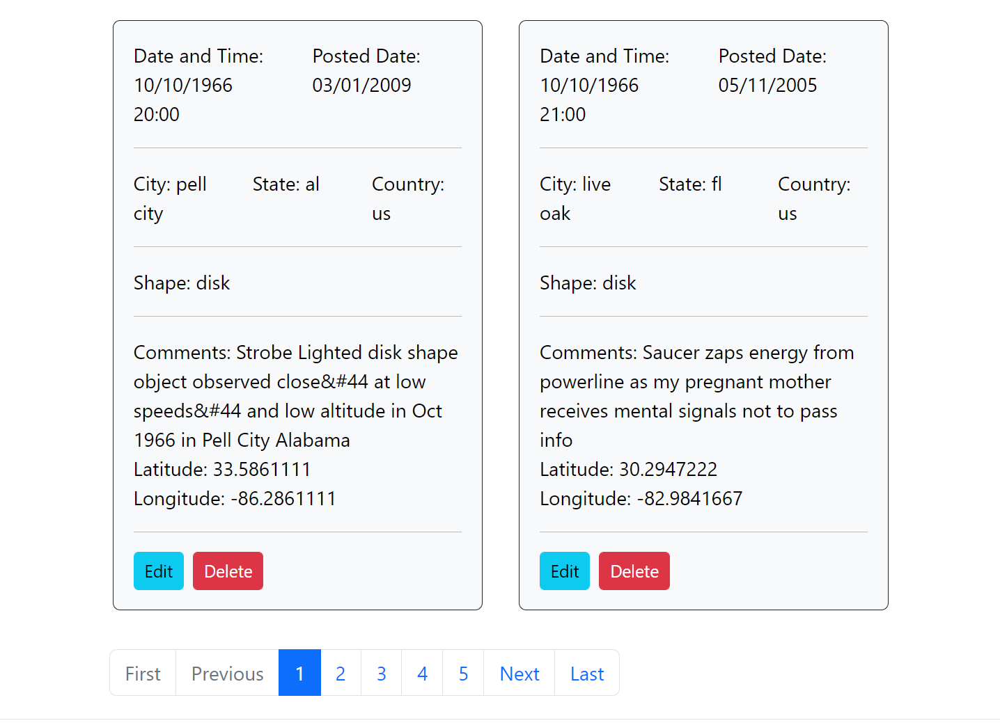
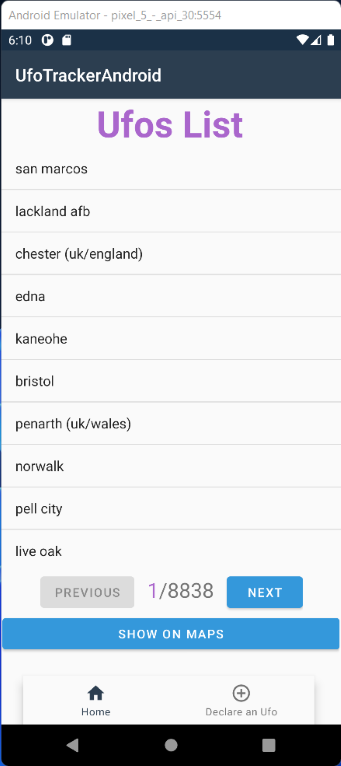

# UfoTracker

Ufo Tracker est un ensemble d'applications développé en C#(.NET) qui permet la déclaration d'un OVNI ou de PAN (phénomènes aérospatiaux non identifiés).
Ces applications permettent également le suivi de ces phénomènes à parcourir autour de cartes.

---

## Data

La data utilisée dans ces applications provient du NUFORC (National UFO Reporting Center) elle comprend un peu moins de 90 000 témoignages recensé par le NUFORC. Ces data seront completé par celle du GEIPAN (Groupe d'études et d'informations sur les phénomènes aérospatiaux non identifiés) dans un futur proches.<br>
Data du NUFORC a télécharger ici:  [ufo.json](ufo.json)



--- 
## Architecture



La partie base de données se repose sur MongoDB.<br> 
La solution .NET regroupe 4 entitées. 
- UfoTrackerModels
- UfoTrackerApi
- UfoTrackerWeb
- UfoTracker Android
--- 


## UfoTracker.Models

UfoTracker Models est une bibliothèque de classe C# .NET qui permet d'utiliser les classes dans l'ensemble des projets constituants la solution. 
Elle est composée de deux modèles:
- Ufo.cs

``` C#
public class Ufo
    {
        [BsonId]
        [BsonRepresentation(BsonType.ObjectId)]
        public string? Id { get; set; }

        [BsonElement("datetime")]
        public DateTime? DateAndTime { get; set; }
        [BsonElement("city")]
        public string? City { get; set; }
        [BsonElement("state")]
        public string? State { get; set; }
        [BsonElement("country")]
        public string? Country { get; set; }
        [BsonElement("shape")]
        public string? Shape { get; set; }
        [BsonElement("comments")]
        public string? Comments { get; set; }
        [BsonElement("date posted")]
        public DateTime? DatePosted { get; set; }
        [BsonElement("latitude")]
        public string? Latitude { get; set; }
        [BsonElement("longitude")]
        public string? Longitude { get; set; }
    }
```
- PageMongo.cs
``` C#
public class PageMongo
    {
        public int Count { get; set; }

        public int Page { get; set; }

        public int Size { get; set; }

        public IEnumerable<Ufo> Ufos { get; set; }
    }
```

--- 
## UfoTracker.API

UfoTracker Api est une Api Rest développer en C# .NET qui est en charge de communiquer avec la base MongoDb et qui permet de fournir et de récupérer l'ensemble des données des applications web et mobile.

Page Mongo permet d'avoir une pagination dans le GetAll.



--- 
## UfoTracker.WEB

UfoTracker Web est une application Web ASP.NET qui s'appuie sur UfoTracker.API et UfoTracker.Models. Elle dispose de plusieurs features que nous allons parcourir.



### Carte 
La carte utilise l'api de google maps. Elle affiche des markers correspondant à la page. 
les icones des markers sont spécifiquent selon la forme de l'Ufo aperçu. 

https://user-images.githubusercontent.com/28070766/185203747-1ad9dd7f-c6b8-4a72-9c43-f03777078d92.mp4

### Déclarer un UFO
L'application permet une déclaration d'une apparition rapidement grâce à son formulaire.

Pour simplifier la complexité de l'utilisateur l'outil permet de prendre la date et l'heure exact de la personne ainsi que sa latitude et sa longitude grâce à la localisation de son navigateur. 

https://user-images.githubusercontent.com/28070766/185207877-ddab0356-b2fa-4c29-a7ad-18c6284c51df.mp4

### Autres fonctionnalités CRUD et autres

Bien entendu l'application permet également la modification et la suppression des déclarations. <br>
Elle dispose également d'une pagination rattacher à celle de l'Api.



--- 

## UfoTracker.Android

UfoTracker Android est une application Xamarin elle permet les mêmes fonctionnalités que l'application web pour la gestion et la déclaration d'UFO. 



### Opérations CRUD et pagination

L'application Android permet d'effectuer des opérations CRUD sur le système ainsi que de défiler les milliers de déclarations. 


https://user-images.githubusercontent.com/28070766/185213525-2d22fbfc-8d02-4e64-a668-0a66218c919b.mp4

### Carte 
La carte utilise google maps. elle affiche des markers correspondant a la page. 
les icones des markers sont également spécifiquent selon la forme de l'Ufo aperçu.

https://user-images.githubusercontent.com/28070766/185214625-e3b83589-dee9-4199-84ce-66e60ac85f20.mp4


